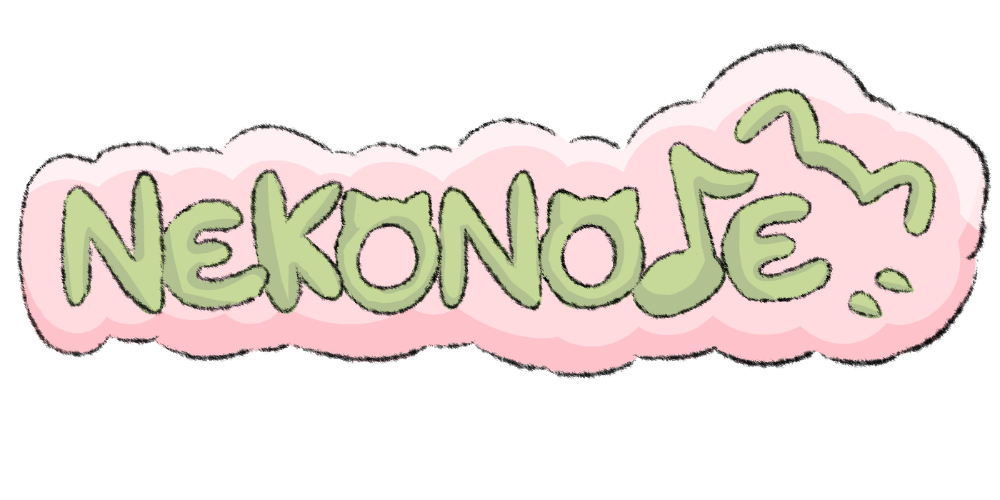

NekoNote makes rhythm games more customizable by allowing the user to play their favorite music without being constricted to a rhythm game's music library. The user uploads their own music file and waits for python ML libraries to convert the "parts" of the song into 4 separate beatmaps. These beatmaps are then fed into html and javascript to be displayed on the game screen.

